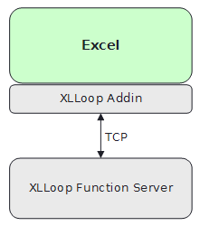
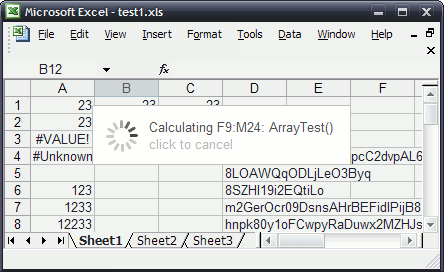

#  XLLoop 

Excel User-Defined Functions in Java, Javascript, Ruby, Python, Erlang

## About

XLLoop is an open source framework for implementing Excel user-defined functions (UDFs) on a centralised server (a function server). 



Why is this useful?
* Functions can be written in any language (e.g. Java, scripting languages etc..)
* Functions can be added quickly and dynamically without users having to restart Excel.
* Functions can be managed separately and centrally, which avoids the costly overhead of managing many XLLs and ensures all users are using the same functions.
* Data can be shared across excel sessions/users (e.g. current stock market prices can be stored on a single server and all Excel sessions could retrieve this data via a GetStock function).

It has the following features:
* Extensible Java server framework.
* Native server frameworks written in many other languages (see languages section).
* Popup for long running operations (with option to cancel)
* Support for hosting C++ XLLs via [JXLL](./org.boris.jxll).
* Reflection-based function adaptor for extremely quick deployment of java methods.
* Bean scripting framework adaptor so functions can be written in any BSF-supported language (eg. Ruby, Python, Javascript).
* [Lisp Function Handler](./docs/lisp-handler.md) for evaluating Lisp expressions on the fly.
* Functions can be dynamically added to Excel without restart.
* Functions can be registered as Excel functions (with help information).
* Fast binary protocol with multiple-server fail-over/scalability.
* JSON over HTTP(S) protocol
* NEW: Can be configured to connect to multiple function servers (providers)

XLLoop consists of two main components:
* An Excel addin implementation (XLL written in c++).
* A server and framework written in java (and in many other languages - see languages section).

The addin and server communicate via a simple socket-based protocol, sending and receiving (binary) serialised excel objects (called xlopers). 

In JSON mode the addin and server communicate over http(s), sending and receiving JSON serialised excel objects. 

XLLoop is licensed under the [Common Public License (CPL)](http://www.eclipse.org/legal/cpl-v10.html).

## Download 

See [Releases](https://github.com/poidasmith/xlloop/releases) section

## Language Support

The following table summarizes the current support for different languages.

Language	|Supported?
------------|----------
Java    |Yes, native server (binary and json)
C++ |Yes, via XLLServer (included in download)
[Erlang](./docs/erlang-server.md)   |Yes, native server
[Lisp](./docs/lisp-handler.md)  |Yes, using Jatha
[Ruby](./docs/ruby-server.md)	|Yes, a native ruby server is included in the download.
[Python](./docs/python-server.md)	|Yes, a native python server is included in the download.
[PHP](./org.boris.xlloop/servers/php/TestServer.php)	|Yes, a native server (json) is included in the download.
Javascript	|Yes, using Rhino
[R](./docs/r-server.md)	|Yes, a native R server is included in the download.
[Perl](github.com/aero/XLLoop-perl5)	|Yes, a native Perl server has been implemented by github user aero

## Usage

An example of a very simple server that exposes the methods in the java.lang.Math class:

```java
package org.boris.xlloop.util;

import org.boris.xlloop.FunctionServer;
import org.boris.xlloop.handler.*;
import org.boris.xlloop.reflect.*;

public class ServerExample
{
    public static void main(String[] args) throws Exception {
        // Create function server on the default port
        FunctionServer fs = new FunctionServer();

        // Create a reflection function handler and add the Math methods
        ReflectFunctionHandler rfh = new ReflectFunctionHandler();
        rfh.addMethods("Math.", Math.class);
        rfh.addMethods("Math.", Maths.class);
        rfh.addMethods("CSV.", CSV.class);
        rfh.addMethods("Reflect.", Reflect.class);

        // Create a function information handler to register our functions
        FunctionInformationHandler firh = new FunctionInformationHandler();
        firh.add(rfh.getFunctions());

        // Set the handlers
        CompositeFunctionHandler cfh = new CompositeFunctionHandler();
        cfh.add(rfh);
        cfh.add(firh);
        fs.setFunctionHandler(new DebugFunctionHandler(cfh));

        // Run the engine
        System.out.println("Listening on port " + fs.getPort() + "...");
        fs.run();
    }
}
```

This will expose all the java.lang.Math functions inside excel. Excel usage is as follows:

```
=FS("Math.random")
=Math.random()

=FS("Math.sin", 3.14)
=Math.sin(3.14)

=FS("Math.pow", 2, 4.45)
=Math.pow(2, 4.45)
```
## Configuration

The addin can be customized using an INI file with the same name as the addin. Eg. (xlloop.ini). The INI file can accept the following settings:

Key	|Description
-----|-----
protocol	|Specifies the protocol to use ("binary" or "http"). Defaults to binary.
server	|When in binary mode, this is a list of servers to connect to (eg. "server=localhost:5454,localhost:5455")
server.selection.mode	|Set this to "round-robin" to use a connect to servers in the order which they appear in the server list (the default is random).
server.retry.count	|This will cause the addin to attempt to connect to subsequent servers in the list if the first connection attempt fails
url	|The URL to connect to when in "http" mode (eg. "url=http://localhost:8080/functionserver")
addin.name	|This is the name that will appear in the Excel addin manager window (default is addin filename without extension).
function.name	|This is the name of the function that will be registered in excel (default is "FS").
include.volatile	|This is a switch to include a volatile version of the "FS" function.
function.name.volatile	|This is the name of the volatile version of the function (default is "FSV").
generic.function.category	|The category under which the generic functions will be registered (default is "General").
disable.function.list	|Set this to "true" to switch off dynamic excel function registration.
send.user.info	|Set this to "true" to send username/hostname to server when session initializes (default is true).
user.key	|A string that is sent as the third argument to the initialize function on session startup.
send.caller.info	|Set this to "true" to send sheet/cell information to each function (default is false).
disable.calc.popup	|Set this to "true" to disable the popup.
disable.calc.cancel	|Set this to "true" to disable to 'click to cancel' feature.
ini.file.location	|The addin will include INI keys from the file location specified (eg "C:\Program Files\MyApp\include.ini")
ini.registry.location	|The addin will include INI keys from the registry location specified (eg "HKEY_CURRENT_USER\Software\MyApp"). Currently only string and DWORD values are supported

## Popup For Long Running Operations

The following screenshot shows the popup in action: 



The popup will appear after receiving no response from the server for a couple of seconds. It will automatically disappear when the server responds. The user can click the popup to terminate the connection to the server (it will automatically reconnect on the next function call). 

Note that this feature can be disabled via the INI file (see table above).

## Function Information Registration

The addin can register function information/help with Excel on startup. This is is achieved by calling a special function on the server called `org.boris.xlloop.GetFunctions`. 

The server responds with an array of FunctionInformation objects (which are encoded as arrays). 

The addin then calls the `Excel4(xlfRegister, ...)` function to register each function. The user will then see the help information via the Insert->Function menu. 


Note that the Java server framework has a handler called `FunctionInformationFunctionHandler`, which accepts FunctionInformation objects. This handler implements the special function above. For an example see the ServerExample class in the Java source.	

The following code example shows how to uses annotations to add function information when using the `ReflectFunctionHandler` handler:

```java
package org.boris.xlloop;

import java.io.File;

import org.boris.xlloop.reflect.XLFunction;
				
public class AnnotationsTest
{
    @XLFunction(name = "ListFiles", 
            help = "List the files contained within a directory", 
            args = { "dir" }, 
            argHelp = { "The directory" }, 
            category = "Files")
    public static String[] listFiles(String dir) {
        return new File(dir).list();
    }
}
```
## Lisp Example

The following page shows an [example lisp function handler](./docs/Lisp.md).

## Bean Scripting Framework Support

The following example shows a server that exposes all scripts within a directory (and sub directories) as functions:

```java
package org.boris.functionserver;

import java.io.File;

import org.boris.functionserver.reflect.ReflectFunctionHandler;
import org.boris.functionserver.script.ScriptRepository;
import org.boris.functionserver.util.CompositeFunctionHandler;

public class ServerTest 
{
    public static void main(String[] args) throws Exception {
        FunctionServer fs = new FunctionServer();
        ReflectFunctionHandler rfh = new ReflectFunctionHandler();
        ScriptRepository srep = new ScriptRepository(new File("functions"), "Script.");
        rfh.addMethods("Math.", Math.class);
        CompositeFunctionHandler cfh = new CompositeFunctionHandler();
        cfh.add(rfh);
        cfh.add(srep);
        fs.setFunctionHandler(cfh);
        fs.run();
    }
}
```

An example script called "mult.js", written in javascript simply multiplies the two numbers entered:

```
args[0] * args[1];
```

This can be called from Excel with the configuration above as follows:

```
=FS("Script.mult", 45.3, 23)
=Script.mult(45.3, 23)
```

## Multiple Server Support

The binary protocol supports connecting to multiple servers to improve reliability and scalability. 

The approach is simple; it connects to a random server, if this fails it reports an error to the user. If the user attempts to connect again (ie. by invoking another function) the addin will choose a random server to connect to. The following example shows an INI file with multiple servers specified.

```
server=localhost,localhost:5455,myserver:9000
```

If a port is not specified it uses the default of 5454.

## JSON over HTTP Protocol

The addin supports a JSON over HTTP protocol. Each function invocation is a separate HTTP request. The input data is sent via a POST method. The result is a single xloper object encoded in JSON. To enable this feature setup the INI file as follows:

```
protocol=http
url=http://localhost:8000/FunctionServer
```

The JSON input request looks like:

```
{
    "args": [],
    "name": "Math.random",
    "request": "XLLoop",
    "version": "0.1.0"
}
```

The result JSON looks like:

```
{
    "num": 0.8091614905358369,
    "type": 1
}
```

## Multiple Function Providers

XLLoop can be configured to connect to multiple function servers. The following shows an example of the INI file configuration to achieve this:

```
providers=Java,Python,Ruby,PHP
include.volatile=false

[Java]
server=localhost

[Python]
server=localhost:5460
function.name=PY

[Ruby]
server=localhost:5470
function.name=RB

[Erlang]
server=localhost:5480
function.name=ERL

[PHP]
protocol=http
url=http://xlloop.sourceforge.net/servers/php/TestServer.php
send.caller.info=true
function.name=LP
```

Each provider specified in the providers property (comma-separated list) refers to a section in the INI file. Each section accepts all the INI properties listed in the table above (apart from global properties). 

This will setup connections to multiple servers. The function.name property is used to set the generic function name registered for that server. For example, to invoke a python function from the server at localhost:5460 you could write the following formula:

```
=PY("ArgsTest", "Hello World!")
```

Note that difference between configuring multiple servers for one function provider and configuring mutiple function providers. Multiple function server instances serve up the same functions whereas multiple function providers each provide a different set of functions. Also note that no attempt is made to reconcile function name clashes between function providers.


